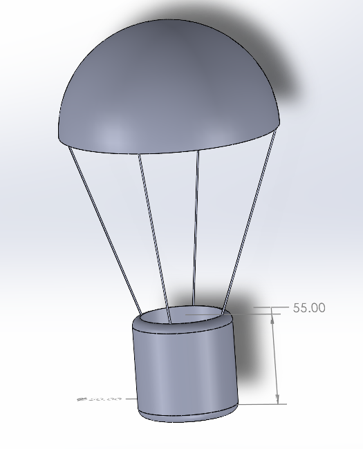

# - Egg Drop Project - 

<h2> Description </h2>

I was tasked to design a reusable vessel intended to protect a raw chicken egg during a drop from height. It was intended to take a payload mass of approximately 55g, the drop path, orientation, and attitude during descent were not defined and open for me to considered as part of the design.

I decided a parachute would be the safest and most reliable mechanism to protect the egg while remaining reusable. It also gave me the chance to learn about parachute design and the physics behind it. 

To start I thought of the rough design, then researched materials that would be suitable for the criterium. Once the materials were decided on; then size, weight and drag calculations were done to create parameters for the CAD. Bellow I go into more detail about the materials used, as well as some mechanics calculations.

<h2> CAD Design </h2>

Being my first experience with any CAD, it took some time and effort to create the design for the capsule, however it was extremely beneficial and rewarding. 

 

  
   
  <em> Whole Capsule </em>

